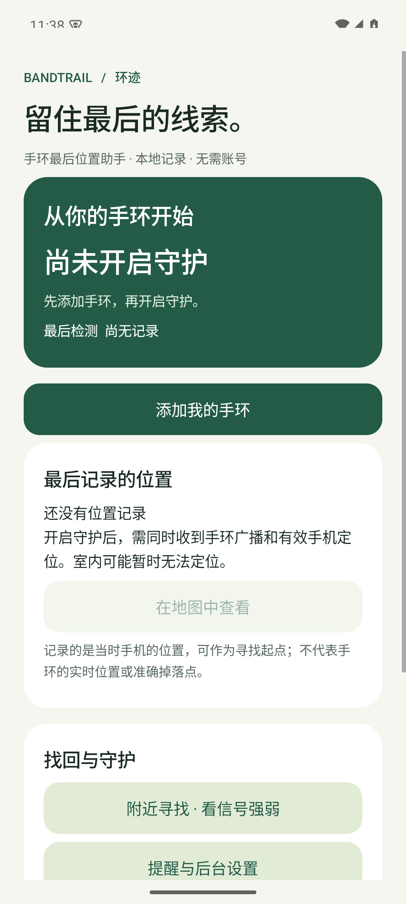
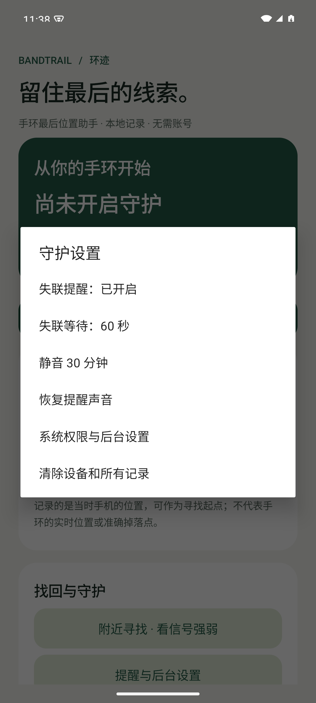
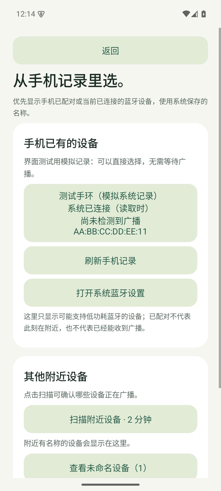

<div align="center">

# 环迹 · BandTrail

**留住最后的线索。**

轻量、离线、开源的 Android 手环 / 手表最后位置助手。

[下载 APK](https://github.com/jy41319/bandtrail/releases) · [安装与验证](docs/GETTING_STARTED.md) · [设计与开源参考](docs/ENGINEERING.md) · [隐私说明](PRIVACY.md)

[](https://github.com/jy41319/bandtrail/actions/workflows/android.yml)

</div>

**你有没有想过，如果你的智能手环 / 手表丢了，该怎么办？**

如果设备没有定位查找功能，连最后在哪里见过它都想不起来，寻找就无从下手。

现在，环迹可以帮你留住这条线索：在设备兼容、提前开启守护并成功获取位置的情况下，记录**手机最后检测到手环 / 手表时的手机位置**。发现设备不见了，就能回到最后记录的位置附近寻找，更快缩小搜索范围，为找回心爱的设备多一份机会。

> **0.1.1-alpha：实验版。** 软件构建与逻辑测试不等于硬件兼容性验证。小米手环 11、与小米运动健康共存、跨品牌息屏稳定性和耗电均须真机测试。只对仍在广播、地址保持稳定的设备有效。

## 0.1.1 更新：从手机记录选择

读取 Android 公开的已配对设备与当前 GATT 连接列表，按系统别名、系统缓存名、广播名的顺序显示。相同蓝牙地址合并，未命名的附近广播默认折叠。已有记录即使暂时不广播也能添加，重新选择同一设备保留位置。

手机系统配对记录不一定等于小米运动健康内部的绑定记录；本应用不能读取其他 App 的私有配置。“已配对/系统已连接”只用于设备选择，不当作实时广播或位置证据。识别之后仍需验证守护兼容性。

## 界面

<p align="center">
  
  
</p>

Android 15 模拟器实拍；未使用伪造的手环位置。

<p align="center"></p>

新版选择页截图使用明确标注的模拟系统记录验证界面，不代表已在真实手环上获得记录。

## 它能做什么？

- **最后位置**：保存手机最后检测到目标 BLE 广播时的手机位置，分别展示观测时间、定位时间与精度。
- **失联提醒**：在本次守护中确实看到设备后，持续未收到广播才提醒；支持 30 / 60 / 120 秒阈值和临时静音。
- **附近寻找**：短时高频扫描，显示平滑后的 RSSI 信号强弱，离开页面即停止。
- **兼容性诊断**：记录观测次数、最大观测间隔、扫描失败和状态变化；可复制不含设备地址、名称和坐标的诊断文本。
- **本地优先**：无账号、服务器、地图 SDK、广告或统计 SDK；应用不申请网络权限。

这是寻找起点，**不是手环实时 GPS、精确掉落点、众包查找网络或防丢保证**。必须在丢失前开启守护，无法追溯以前的位置。隔墙、广播暂停、地址轮换都可能造成“暂未检测到”。

## 安装

1. 从 [Releases](https://github.com/jy41319/bandtrail/releases) 下载签名 APK，按系统提示允许安装。
2. 打开应用 → 添加我的手环 → 授予附近设备权限，优先从“手机已有的设备”选择。系统保存的名称/别名会优先显示，不必先扫描或授权定位。
3. 列表没有时，可扫描附近设备（需要精确定位），或输入手环蓝牙地址。未命名设备默认折叠；不要凭同名或信号强弱认定设备身份。
4. 保持小米运动健康的正常连接，确认环迹也能看到你的手环。
5. 授予精确位置和通知权限，开启守护，确认有检测时间和有效位置；再进行息屏、离开和返回测试。

守护期间会有常驻通知。应用不接管、不认证、不写入手环。重启、强制停止或系统终止后需要重新打开应用开启守护。后台省电可能延迟提醒；过长的调度空档会显示监测中断。

**要求：Android 10+，支持 BLE。** 不依赖 Google Play 服务。第一版仅中文、单设备；不是 iOS 或 HarmonyOS NEXT 应用。高德及百度地图通过外部应用打开，未安装时可复制 WGS84 坐标。地图实机点位核对尚待完成。

## 兼容性

| 项目 | 当前状态 |
|---|---|
| 通用 BLE 广播扫描与地址过滤 | 已实现；只适用于可观察且地址稳定的设备 |
| 小米手环 11 | 尚未真机验证，不声称完整支持 |
| 小米 17 / HyperOS | 首选测试环境，尚未接入真机 |
| 其他 Android 品牌 | 使用系统 API；后台策略需分别验证 |
| 小米运动健康共存 | 被动扫描设计，不主动抢占连接；实际可观察性待测 |
| 随机地址轮换 | 不支持跨地址身份解析，需要重新选择设备 |
| 手环震动、健康数据同步 | 不提供 |

已完成的构建、模拟器测试和签名检查见 [验证报告](docs/TEST_REPORT.md)。

## 本地构建

安装 JDK 17、Android SDK Platform 35、Build Tools 35.0.0，将 SDK 路径写入 `local.properties`（不提交 Git）：

```properties
sdk.dir=/your/path/to/Android/sdk
```

```bash
./gradlew testDebugUnitTest lintDebug assembleDebug
./gradlew connectedDebugAndroidTest  # 需要已启动的模拟器或连接的测试手机
./gradlew assembleRelease           # 默认生成未签名 Release
```

调试包使用 `.debug` 包名，可与正式包共存。发布签名通过 `BANDTRAIL_KEYSTORE`、`BANDTRAIL_STORE_PASSWORD`、`BANDTRAIL_KEY_PASSWORD` 环境变量传入，别名为 `bandtrail`。**不要提交签名密钥或密码。** 本机私有签名目录已配置时，也可运行 `python3 scripts/build-release.py`；脚本不会打印签名密码。

## 实现与参考

原生 Java + Android Views + 系统 BluetoothLeScanner / LocationManager；应用运行时不引入第三方库。少量本地状态使用 SharedPreferences，诊断事件最多保留 100 条。

参考了 [iTag](https://github.com/s4ysolutions/itag) 的最后位置与外部地图流程、[Nordic Scanner Compat](https://github.com/nordicsemi/Android-Scanner-Compat-Library) 对息屏扫描与过滤的说明，以及 [Gadgetbridge](https://gadgetbridge.org/gadgets/wearables/xiaomi/) 的型号与协议兼容性资料。没有复制它们的实现代码；取舍与来源见 [技术说明](docs/ENGINEERING.md)。

## 参与测试

请根据 [真机验证清单](docs/GETTING_STARTED.md) 提交系统版本、手环型号/固件、官方 App 连接状态以及脱敏诊断。不要在公开 Issue 上传真实坐标或完整蓝牙地址。

MIT License。独立社区项目，与小米及上述开源项目无隶属关系。
